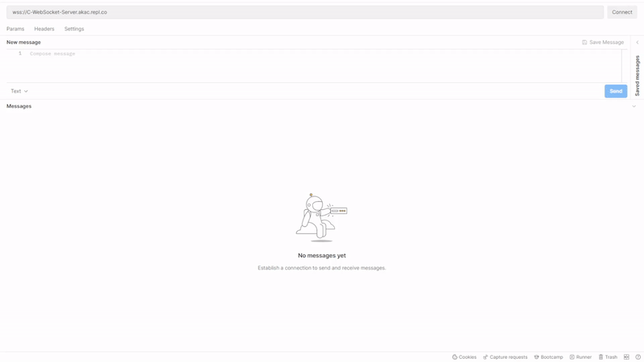

# C# WebSocket Server

This is a template repl for building a WebSocket server using HttpListener in C#. This example offers a message echo function - anything that you send into the WebSocket is immediately sent back to you.

